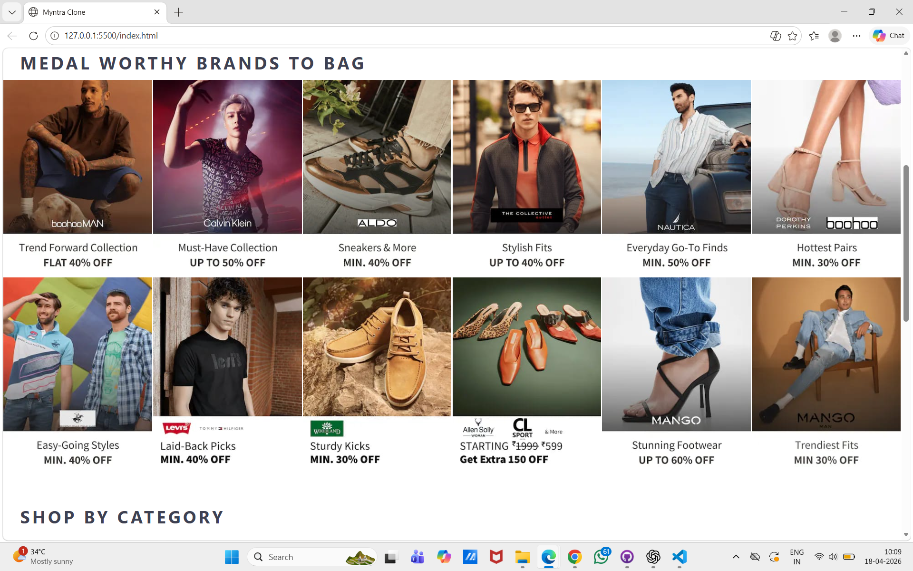
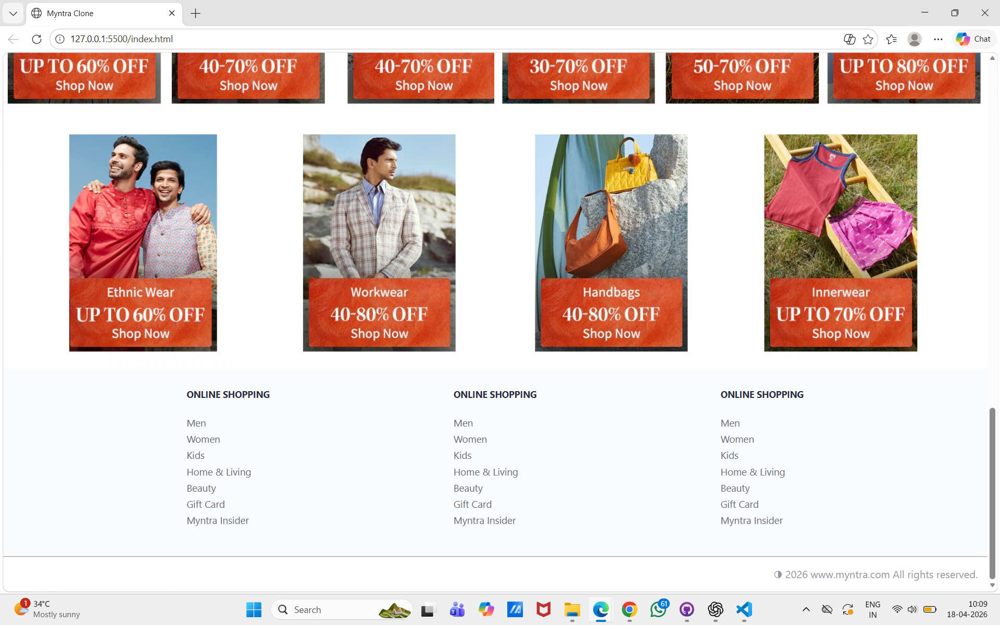

# myntra-clone-ui
This is a Myntra homepage UI clone built using HTML and CSS. The project focuses on designing a clean and responsive e-commerce website layout.

This project helped me understand real-world UI design, layout structuring, and CSS styling.

## 🚀 Features
- Responsive design (basic)
- Navigation bar with categories
- Search bar UI
- Product sections and banners
- Clean and structured layout

## 🛠️ Tech Stack
- HTML5
- CSS3

## 📂 Project Structure
- index.html
- style.css
- images/

## 📸 Preview

## 📌 Future Improvements
- Add JavaScript functionality (Add to Cart, Search)
- Improve responsiveness for all devices
- Add animations and better UI interactions

## 🙋‍♀️ Author
- Divya Bhoyar
